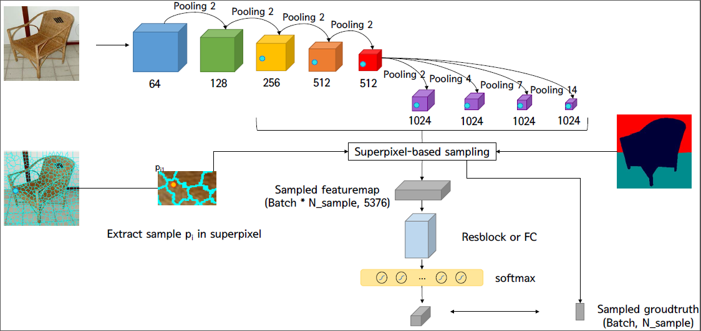
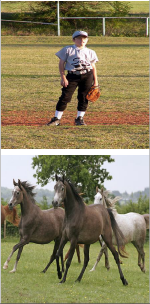
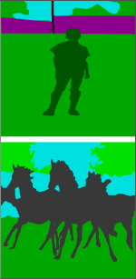
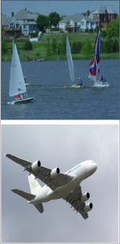
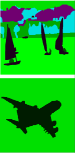
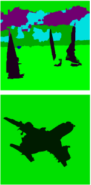

# Superpixel-based Semantic Segmentation Trained by Statistical Process Control

This is a caffe implementation of the paper [Superpixel-based Semantic Segmentation Trained by Statistical Process Control](https://arxiv.org/abs/1706.10071)



## Additional Datasets
Please download superpixel result of Pascal Context or use Matlab 
download [here](https://drive.google.com/file/d/1P2qUPGpwe6iCDAJxV7ltU3glh16u_Q_v/view?usp=sharing)

## Run Model
install caffe from [here](https://drive.google.com/file/d/1-FcQjq3TqP6Gtie5w36NPkpOobO98xtT/view?usp=sharing) and run solve.py

## result
   

  


##Citing HP-SPC

If you feel interest from my research, please consider citing:
```
@article{park2017superpixel,
  title={Superpixel-based semantic segmentation trained by statistical process control},
  author={Park, Hyojin and Jeong, Jisoo and Yoo, Youngjoon and Kwak, Nojun},
  journal={arXiv preprint arXiv:1706.10071},
  year={2017}
}
}
```

## Acknowledgements
- [PixelNet](https://github.com/aayushbansal/PixelNet)
- [FCN](https://github.com/shelhamer/fcn.berkeleyvision.org)
